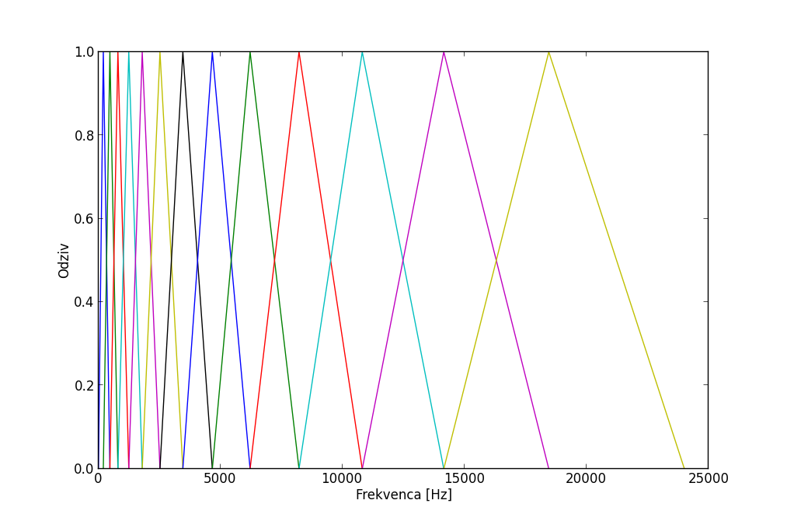

Identifikacija govorca
======================

Seminarska naloga pri predmetu Digitalno procesiranje signalov

Za seminarsko nalogo sem izbral prepoznavanje (identifikacijo) govorca izmed nabora znanih glasov. Za to je potrebno izvesti analizo signala in iz analiziranega signala povzeti značilke, ki predstavljajo lastnosti signala, na podlagi katerih bo sistem znal razlikovati med govorci.

Teoretične osnove
-----------------

Osnovna obdelava signala predstavlja segmentiranje signala na odseke, množenje z okensko funkcijo in izračun diskretne Fourierjeve transformacije. Odseke sem vzel dolžine 1024 vzorcev, kar pri vzorčenju s 48000Hz predstavlja 21,333 ms.

Iz izračunanega spektruma sem za izvleček značilk uporabil koeficiente kepstruma Melove frekvenčne lestvice oz. po angleško *Mel frequency cepstrum coefficients* (MFCC). To so značilke, ki z matematičnimi transformacijami skušajo signal pretvoriti v manjše število značilk, ki posnemajo zaznavanje človeškega ušesa.

Te koeficiente dobimo tako, da najprej amplitudo spektra signala kvadriramo, da dobimo spekter moči. Potem ta spekter moči filtiramo z Melovimi filtri. To so trikotni filtri, ki imajo prepustne pasove določene tako, da so prilagojeni zaznavanju človeškega ušesa. Pretvorba iz enot frekvenc v mel je določena z enačbo::

  mel = 1127.01048 * ln(1 + frekv / 700.0)

Primer filtrov, uporabljenih za pridobivanje koeficientov. Na sliki je 13 filtrov za 13 koeficientov, sam sem uporabil 41 filtrov.

Tako dobljeno končno število koeficientov ustreza jakosti signala na določenem frekvenčnem območju, ki ga posamezen filter prepusti. Te koeficiente se zatem logaritmira, da bolje predstavljajo jakost, kakor jo zaznava uho. Nazadnje nad dobljenimi koeficienti izvedemo še DCT tipa 2, da dobimo koeficiente MFCC.

Ti koeficienti oz. značilke so zatem osnova za prepoznavanje govorca. Običajno se za prepoznavo govorca ignorira prvi koeficient, ker ne nosi veliko informacije o značilnosti govorca. Vsak okvir 1024 vzorcev se preslika v en vektor značilk. Vektorje, ki pripadajo istemu govorcu, nato združujemo in na podlagi vektorske kvantizacije poenostavimo v manjše številko gruč, ki jih nadomestijo kodne zamenjave. To naredimo iterativno, na način, da za gostejše gruče uporabimo več kodnih zamenjav. Tako se izgubi čim manj informacij in hkrati najbolje predstavi signal.

Dobljene kodne zamenjave uporabimo v fazi prepoznavanja govorca.

Faza prepoznava govorca ustreza temu, da poskusimo vektorje govorca opisati s kodnimi zamenjavami, ki smo jih izračunali v fazi učenja, ob tem pa opazujemo napako pri uporabi kod. Kodne zamenjave, ki bodo ob prepoznavanemu signalu imele najmanjšo napako, bodo tiste, za katere se kodne zamenjave najbolje prilegajo. To pa so zaradi narave izbranih značilk običajno ravno tiste, ki so bile naučene na istem govorcu.

Implementacija
--------------

Za implementacijo algoritmov sem uporabil Python in ustrezne knjižnice za računsko oz. znanstveno obdelavo podatkov numpy/scipy. S tem ostane razvoj algoritmov čitljiv in enostaven, hkrati pa ni potrebe po ponovni (in potencialno napačni) implementaciji že znanih algoritmov.

Knjižnica numpy vsebuje osnovne prototipe in algoritme, kot so matrike in FFT algoritem. Knjižnica scipy pa vsebuje funkcije za branje WAV datotek. Za izvedbo prepoznave govorca sem moral implementirati algoritem izračuna MFCC, ki ni del knjižnic. Po branju spletnih virov sem našel implementacijo, ki je spisana celo v Pythonu. Nekoliko prirejeno sem vključil v projekt - izbral sem ustreznejše privzete vrednosti in izvzel prvi koeficient.

Za klasifikacijo v gruče in vektorsko kvantizacijo na podlagi kodnih zamenjav sem uporabil že v scipy vključen modul scipy.cluster.vq.

Za ocenjevanje ustreznosti se je kot kriterij najbolje obnesla kosinusna razdalja, razmeroma dobra pa je bila tudi minmalna vsota kvadratov napak. Kriterija sta normalizirana na število vzorcev.

Z implementacijo sicer nisem imel večjih težav.

Program
-------

Program je na voljo v datoteki `govorec.py`_. Razvit je bil z uporabo knjižnic numpy različica 1.6.2 in scipy različica 0.11.0.

Učenje govorca poteka z ukazom::

  python govorec.py learn mapa_z_wav

S tem se izračunajo MFCC koeficienti in klasificirajo v gručo, na kateri se zgradijo kodne zamenjave za vektorsko kvantizacijo. Izhodni podatek je tabela kodnih zamenjav, ki se shrani v datoteko mapa_z_wav/codebook.npy.

Razpoznavanje govorca poteka z ukazom::

  python govorec.py recognize vzorec.wav

Program pogleda v vse mape poleg datoteke govorec.py in za tiste, ki vsebujejo codebook.npy, poskuša signal predstaviti s kodnimi zamenjavami tega govorca. Pri tem bo ocena največja pri tisti tabeli kodnih zamenjav, ki je najbližje prepoznavanemu govoru.

Rezultati
---------

Za razvoj in testiranje sem uporabil posnetke sej Državnega zbora Republike Slovenije. Gre za precej dobre vzorce realnega govora. Zvočni zapis občasno vsebuje motnje, kot so npr. šelestenje papirja, govor iz ozadja, zvonec ob prekoračitvi časovne omejitve, ne vsebuje pa glasbe ali drugih podobnih, dlje trajajočih motenj. Prav tako ni sneman v idealnih pogojih, kjer bi se lahko zanašali na kvaliteto posnetka.

Nekateri govorci se izmenjujejo precej hitro, tak primer je npr. predsedujoči, ki sejo moderira in ki ima včasih tudi zgolj nekajsekundne odseke. Debaterji imajo od 2 do 10 minut dolge govore, kar je že razmeroma dolga količina govora, ustrezna za uporabo v fazi učenja.

Za prepoznavo govora sem uporabil različne zvočne izseke: iz nabora posnetkov, na podlagi katerih se je ustvaril seznam kodnih zamenjav, iz nabora posnetkov tretjih sej in iz nabora posnetkov, posnetih za druge namene (pogovorna oddaja po TV).

+-------------------------------+------------+---------------+
| Posnetek                      | Govorec    | Ocena         |
|                               | prepoznan  |               |
+===============================+============+===============+
| ženski govorec A, druga seja  | da         | 0.6453        |
+-------------------------------+------------+---------------+
| moški govorec B, ista seja    | da         | 0.6964        |
+-------------------------------+------------+---------------+
| moški govorec C, seja         | da         | 0.7677        |
+-------------------------------+------------+---------------+
| moški govorec C, oddaja       | ne         | 0.5243        |
+-------------------------------+------------+---------------+

Komentar rezultatov
-------------------

Dobljeni rezultati kažejo, da je mogoča razmeroma enostavna prepoznava govorca z uporabo koeficientov MFCC in vektorske kvantizacije.

Pri odseku, ki je bil del pogovorne oddaje po televiziji, se pri prepoznavi občutno pozna, da je posnetek drugačen, saj ni bil prepoznan pravi govorec, prav tako pa je tudi ocena občutno nižja od primera, kadar je govorec prepoznan. Kaj natančno je drugače se z ušesom ne sliši. K neprepoznavanju govorca je lahko pripomoglo marsikaj: časovna razlika med posnetkoma, razlika v snemalni opremi, razlika v obdelavi posnetka, razlika v uporabljeni kakovosti kompresije posnetka ipd.

Svojevrsten problem, na katerega sam v tem primeru nimam vpliva, je kakovost posnetka. Vsi posnetki so bili vzeti iz videoposnetkov, dosegljivih na spletni straneh RTV Slovenija. Ti posnetki so prilagojeni prenosu preko spleta, kar pomeni, da so zaradi izgubne avdio kompresije - uporabljen je naslednik MP3 zapisa, Advanced Audio Coding (AAC) - v primerjavi z izvirnikom zvoki lahko popačeni.

Naslednja težava so različne konstante, ki močno vplivajo na razpoznavo, npr. kako dolge odseke vzorcev naj analiziramo, koliko naj se odseki prekrivajo, koliko MFCC koeficientov naj računamo, koliko število kodnih zamenjav je optimalno. Vse to so pomembne odločitve, katerih vpliv na uspešnost prepoznave govorca mi je razmeroma neznan in bi ga bilo potrebno obširneje raziskati.

Kakovost bi se zagotovo dalo še izboljšati. Segmentacijo posnetkov glede na govorca sem delal ročno, a menjav govorcev je veliko, zato verjamem, da ponekod menjava ne ustreza resnični menjavi govorca oz. ta lahko časovno odstopa za nekaj sto milisekund. Zato bi morda bilo smiselno upoštevati tovrstno napako in od segmentov npr. odrezati robnih 0,5s.

Določen problem predstavljajo tudi šumi in hkratni govor večih govorcev. En značilen šum, ki bi ga bilo možno razmeroma enostavno zaznati, je opozorilo ob poteku časovne omejitve za govorca. Vzorce s tem zvoncem bi lahko zatem za izboljšanje natančnosti izločili iz nabora koeficientov, na podlagi katerih izvedemo kodne zamenjave.

Velja omeniti, da izbrana izvedba ne upošteva časovnega sosledja izračunanih značilk, kar je pri govoru lahko precej pomembno. Zaradi tega bi morda bilo smiselno preučiti še kako drugo izvedbo, ki to upošteva, npr. skriti Markovski modeli.

Z upoštevanjem zgoraj navedenih omejitev je sistem dovolj dobro delujoč, da sem z njim zadovoljen. Ob zavedanju, da ni primeren za rabo drugje kot na zelo podobnih posnetkih, kljub temu nudi zelo veliko prostora za morebitne izboljšave.

.. _`govorec.py`: ./koda/govorec.py
.. _`MFCC`: http://stackoverflow.com/questions/5835568/how-to-get-mfcc-from-an-fft-on-a-signal

